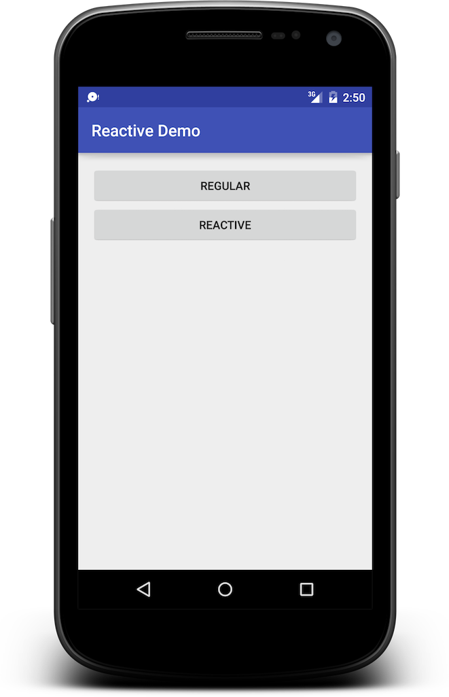

# Reactive/MVVM Demo Android App

This project demonstrates the use of the Model-View-ViewModel pattern combined with reactive programming in a sample Android app.

With a simple on-boarding screen as example, the app contains a traditional implementation, and an implementation with a ViewModel and RxJava.

## Getting started
  1. Open the project in Android Studio and run it in an emulator.
  2. Examine the behavior of the 'regular' implementation. Note that the input validation only occurs after clicking the button.
  3. Examine the behavior of the reactive implementation. Note that validation occurs as soon as the user leaves a field, and while fixing is updated right away.

## Source
The regular implementation is found in `SignupActivity.java`. The reactive version is in `RxSignupActivity.java`, with the view model `RxSignupModel.java`.